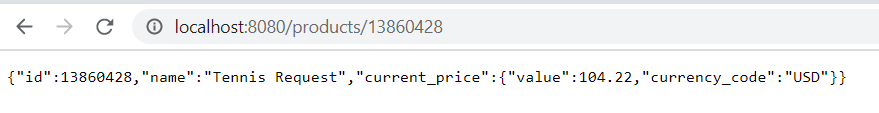

# Getting Started

### Running the Project 
1. Download and install Postgres 13. Set the password for default postgres user.
2. Update application.yml with DBct credentials.
3. Open project in intellij idea and import project.
4. Run MyRetailApplication.java to start the application.

### Assumptions in project 
1. Provided Product Detail Endpoint (http://redsky.target.com/v2/pdp/tcin/13860428?excludes=taxonomy,price,promotion,bulk_ship,rating_and_review_reviews,rating_and_review_statistics,question_answer_statistics) is not accesible. So I have also implemented Datastore for ProductInfo for running it in case API is not accessible.
2. Similar assumption has been made for Price Rest Endpoint as well and a backup datastore is being used.

### Output Screenshot
1. 
2. 
